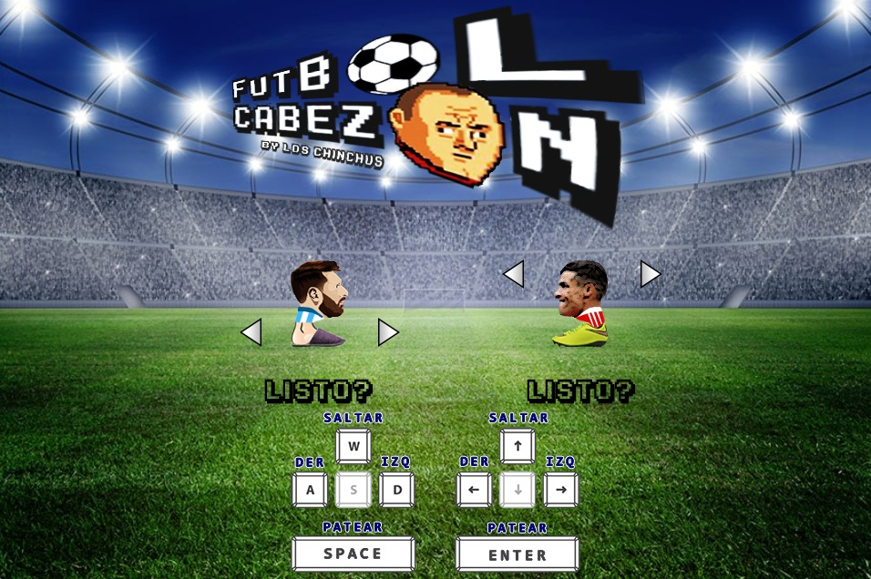
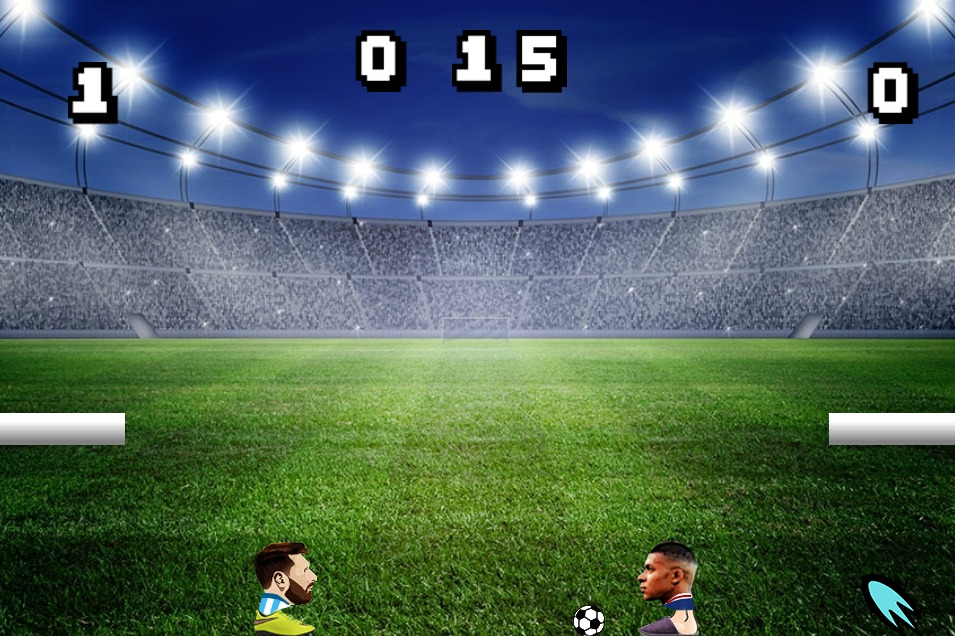
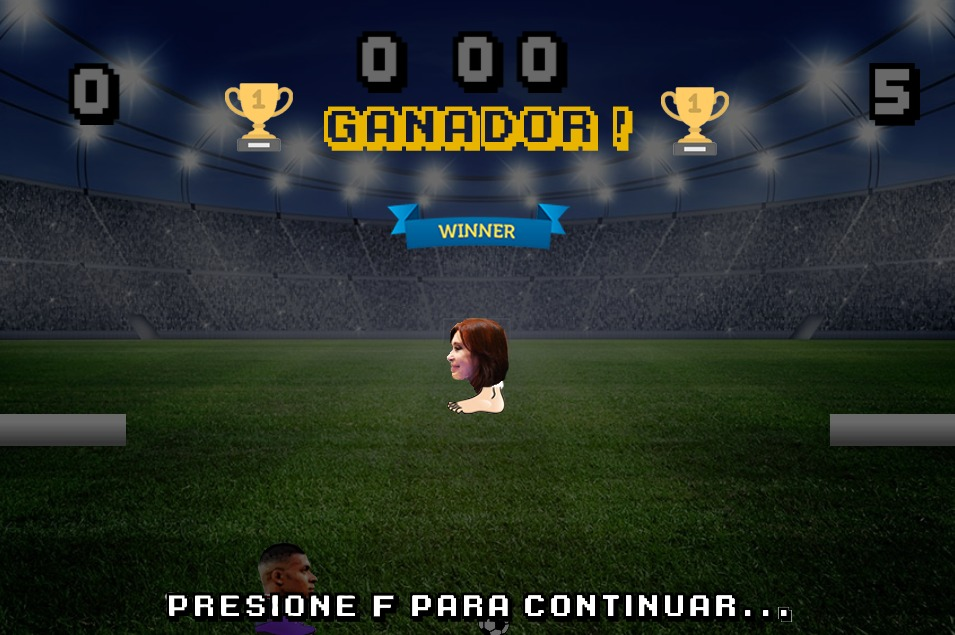

# Fútbol cabezón

## Equipo de desarrollo

- Mateo Ezequiel Bertogliati
- Andrés Martín Trías
- Gianfranco Riccelli
- Guadalupe Sofía García Fariñas

## Capturas

## Instrucciones
1. Elegí y vestí a tu jugador.
2. Cuando estés preparado, cambiá el estado de "listo".
3. Al comenzar el partido, tenés 1 minuto para meter la mayor cantidad de goles.
¡Cuidado! Prestá atención si aparece un power up, podés activarlo pasando por su posición.
	
### Controles

UTN FRBA - Paradigmas de programación - K2104
- Una vez terminado, no tenemos problemas en que el repositorio sea público.
 